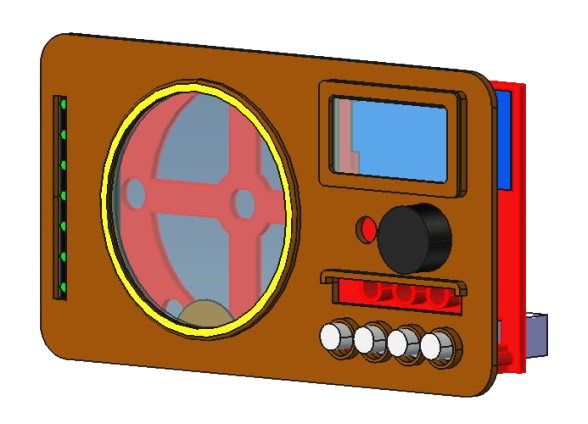
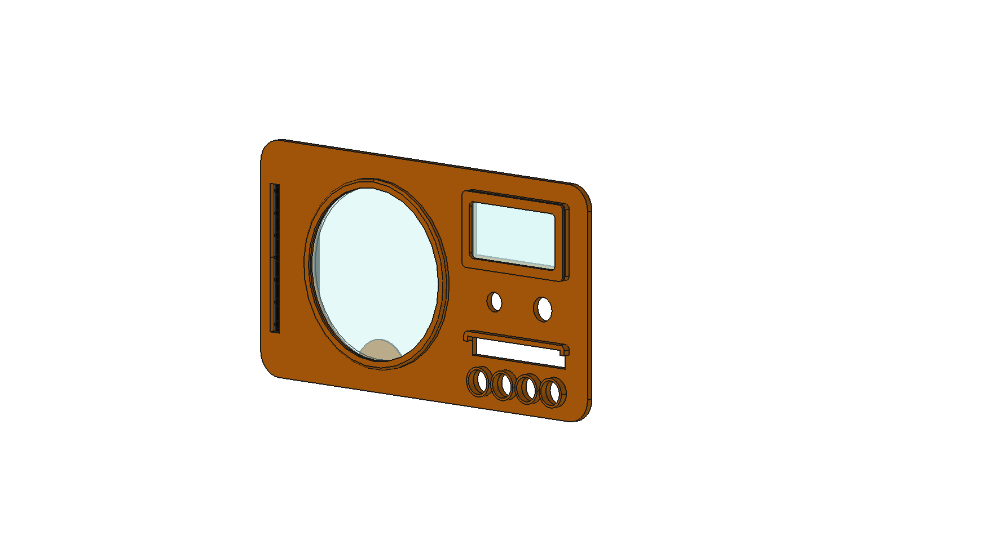
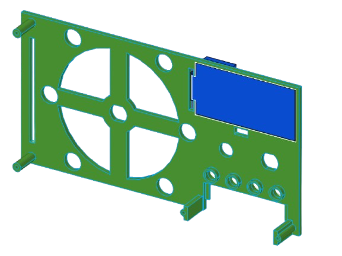
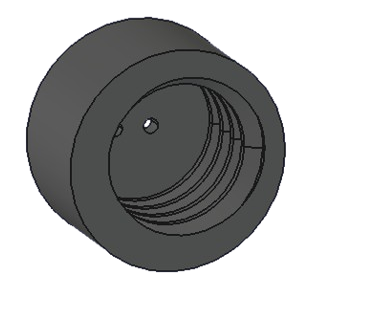

# Vintage Radio — Modèles 3D

Vue d'ensemble du boîtier :

---

## Pièces imprimables

### Face avant

Fichier : [`VintageRadio-FaceAvant.stl`](VintageRadio-FaceAvant.stl)

---

### Support

Fichier : [`VintageRadio-Support.stl`](VintageRadio-Support.stl)

---

### Bouchon LED

Fichier : [`VintageRadio-Bouchon_LED.stl`](VintageRadio-Bouchon_LED.stl)

---

### Rondelle LED

Fichier : [`VintageRadio-Rondelle_LED.stl`](VintageRadio-Rondelle_LED.stl)

---

## Source FreeCAD

Le fichier source est [`VintageRadio.FCStd`](VintageRadio.FCStd).
