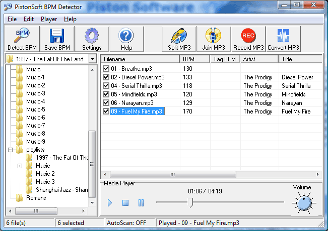

# Préparation du NAS

Le NAS expose des musiques MP3, via un MediaCenter compatible DLNA.

Pour un fonctionnement de base, il n'y a besoin de rien de spécial de plus.

Deux améliorations sont mises en place.  
- Normalisation du volume
- Renseignement du Beat

# Normalisation du volume

Le but est d'éviter d'écouter un morceau avec un son trop faible, suivi par un autre morceau avec un son trop fort, etc.

On utilise un utilitaire [**mp3gain**](https://mp3gain.sourceforge.net/).  

> Tired of reaching for your volume knob every time your mp3 player changes to a new song?
> MP3Gain analyzes and adjusts mp3 files so that they have the same volume.
> MP3Gain does not just do peak normalization, as many normalizers do. Instead, it does some statistical analysis to determine how loud the file actually sounds to the human ear.
> Also, the changes MP3Gain makes are completely lossless. There is no quality lost in the change because the program adjusts the mp3 file directly, without decoding and re-encoding.

Ce package va agir sur tous les fichiers mp3, sans toucher au signal audio lui-même, mais en ajoutant un tag **replayGain** qui est utilisé par VLC lorsque la musique est jouée.

## Application

Cet utilitaire peut être lancé sous Linux, mais étant donné que le Synology ne permet pas l'ajout de packages addionnels (pas de `apt install mp3gain`), on va monter le disque du NAS sous Windows, et lancer l'utilitaire en ligne de commande MS-DOS.

On l'exécute sur tous les sous-répertoires, un-par-un.
```dos
cd M:\Music\Rock

F:\mp3gain\mp3gain.exe /r /p /c *.mp3
```

- option -r : Apply Track gain automatically (all files set to equal loudness)
- option -p : Preserve original file timestamp
- option -c : Ignore clipping warning when applying gain
ou  
- option -s c : Only check stored tag info (no other processing)

> TODO : le faire sur les nouveaux morceaux, au fur et à mesure des ajouts.

# Détection du rythme (Beat Per Minute)

Ce tag **BPM** (Beat Per Minute) permet de distinguer les morceaux calmes des morceaux dynamiques.

## Méthode 1

Utilisation de l'utilitaire FREEWARE [**MixMeister BMP Analyzer**](https://www.mixmeister.com) v1.0.  
*Disponible dans `/bin`*

- Installer **MixMeister BMP Analyzer** (pour Windows 10 - 32bits). 
- Lancer l'application. 
- Sélectionner le répertoire des musiques à analyser. 
- Attendre qu'il ait fini son analyse. 
- Le tag **BPM** est alors automatiquement ajouté à chaque MP3 *(la date du fichier est modifiée)*.

[screenshot](mixmeister.png)

## Méthode 2

Utilisation de l'utilitaire FREEWARE [**PistonSoft BMP Detector**](https://www.pistonsoft.com/bpm-detector.html).  
*Disponible dans `/bin`*

- Installer l'utilitaire **Pistonsoft BPM Detector** (pour Windows Vista - 32bits - 2007). 
- Lancer l'application. 
- Sélectionner le répertoire des musiques à analyser. 
- Attendre qu'il ait fini son analyse. 
- Sauvegarder.
 


Résultats parfois inadéquats...


## Méthode 3

Script python trouvé sur GitHub : [the-BPM-detector](https://github.com/scaperot/the-BPM-detector-python) par Scaperot.

Non essayé.


