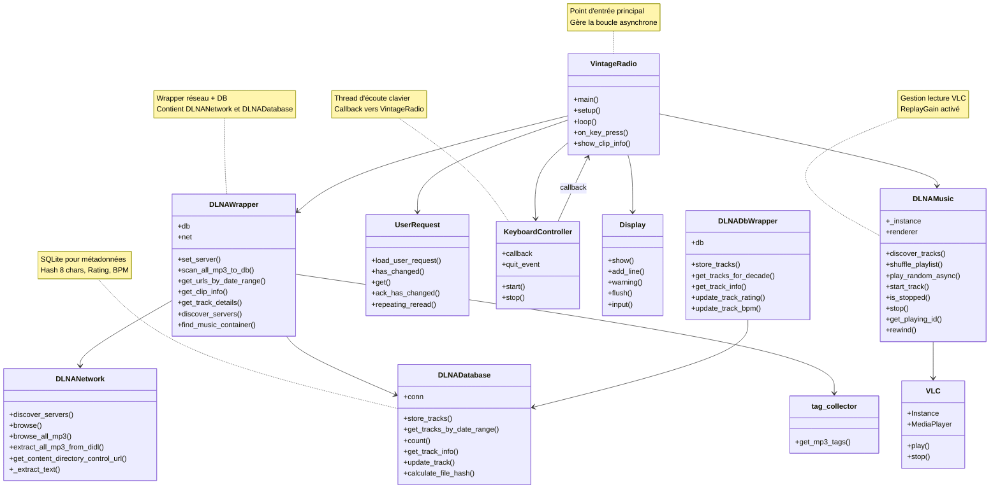

##  Hiérarchie des classes

```mermaid
classDiagram
    %% Main Entry Point
    class VintageRadio {
        +main()
        +setup()
        +loop()
        +on_key_press()
        +show_clip_info()
    }

    %% Core Components
    class DLNAWrapper {
        +set_server()
        +scan_all_mp3_to_db()
        +get_urls_by_date_range()
        +get_clip_info()
        +get_track_details()
        +discover_servers()
        +find_music_container()
        +db
        +net
    }

    class DLNAMusic {
        +discover_tracks()
        +shuffle_playlist()
        +play_random_async()
        +start_track()
        +is_stopped()
        +stop()
        +get_playing_id()
        +rewind()
        +_instance
        +renderer
    }

    class UserRequest {
        +load_user_request()
        +has_changed()
        +get()
        +ack_has_changed()
        +repeating_reread()
    }

    class KeyboardController {
        +start()
        +stop()
        +callback
        +quit_event
    }

    class Display {
        +show()
        +add_line()
        +warning()
        +flush()
        +input()
    }

    %% Network Layer
    class DLNANetwork {
        +discover_servers()
        +browse()
        +browse_all_mp3()
        +extract_all_mp3_from_didl()
        +get_content_directory_control_url()
        +_extract_text()
    }

    %% Database Layer
    class DLNADatabase {
        +store_tracks()
        +get_tracks_by_date_range()
        +count()
        +get_track_info()
        +update_track()
        +calculate_file_hash()
        +conn
    }

    class DLNADbWrapper {
        +store_tracks()
        +get_tracks_for_decade()
        +get_track_info()
        +update_track_rating()
        +update_track_bpm()
        +db
    }

    %% External/Utility
    class tag_collector {
        +get_mp3_tags()
    }

    class VLC {
        +Instance
        +MediaPlayer
        +play()
        +stop()
    }

    %% Relationships
    VintageRadio --> DLNAWrapper
    VintageRadio --> DLNAMusic
    VintageRadio --> UserRequest
    VintageRadio --> KeyboardController
    VintageRadio --> Display

    DLNAWrapper --> DLNANetwork
    DLNAWrapper --> DLNADatabase
    DLNAWrapper --> tag_collector

    DLNAMusic --> VLC

    KeyboardController --> VintageRadio : callback

    DLNADbWrapper --> DLNADatabase

    %% Notes
    note for VintageRadio "Point d'entrée principal<br/>Gère la boucle asynchrone"
    note for DLNAWrapper "Wrapper réseau + DB<br/>Contient DLNANetwork et DLNADatabase"
    note for DLNAMusic "Gestion lecture VLC<br/>ReplayGain activé"
    note for KeyboardController "Thread d'écoute clavier<br/>Callback vers VintageRadio"
    note for DLNADatabase "SQLite pour métadonnées<br/>Hash 8 chars, Rating, BPM"
```
