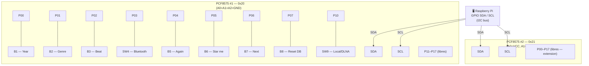

# PCF8575 — Câblage I2C et boutons

## Principe

Un module PCF8575 sur le bus I2C.  
Chaque module a une adresse distincte configurée par ses broches A0/A1/A2.

| Module | A0  | A1  | A2  | Adresse I2C |
| ------ | --- | --- | --- | ----------- |
| #1     | GND | GND | GND | 0x20        |

Le PCF8575 dispose de 16 I/O (P00–P07 + P10–P17). 

## Exeple de schéma



## Câblage des boutons

Chaque bouton est câblé entre la broche I/O du PCF8575 et **GND**.  
La résistance pull-up (RS1 = SIL-9 10kΩ, ou R31/R32 = 20kΩ) tire la broche
vers **3.3V** au repos. L'appui tire vers GND → lecture LOW = appuyé.

```
3.3V ──┬── [10kΩ] ──┬── PCF8575 Pxx
       │            │
       │         [Bouton]
       │            │
      GND          GND
```

## Code Python (lecture)

```python
import smbus2

bus = smbus2.SMBus(1)

# Lire les 16 pins du chip #1 (2 octets : port0, port1)
data = bus.read_i2c_block_data(0x20, 0, 2)
port0, port1 = data[0], data[1]

# Exemple : tester B1 (P00, bit0 de port0)
if not (port0 & 0x01):   # LOW = bouton appuyé
    print("B1 Year appuyé")
```
