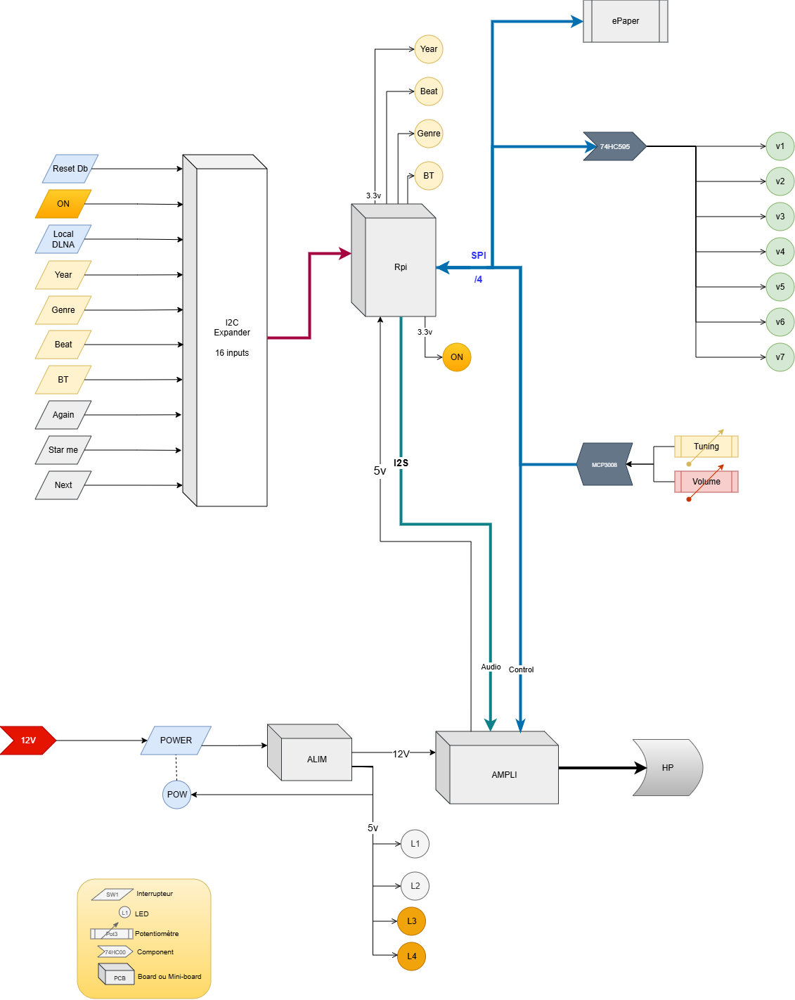

# Vintage Radio

## Architecture générale

## Conception hardware - Les composants.

La liste des composants nécessaires est définie dans ce [Bill Of Material](Components/BillOfMaterial.md).

Le détail des calculs de résistances est dans ce [document](Resistances.md).