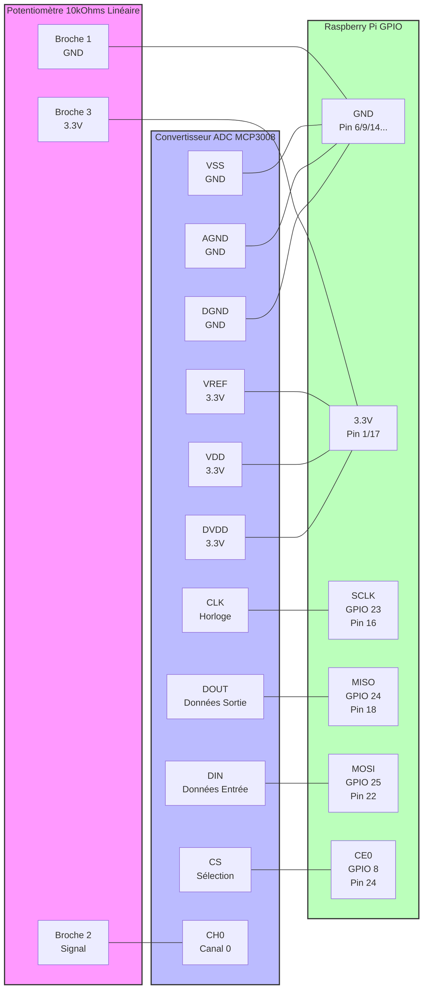

# Vintage Radio

## Bill of Material

-   Convertisseur analogique-numerique (ADC)
	MCP3008 (SPI) : 8 canaux, 10 bits (1024 valeurs). Très simple à câbler, bibliothèque Python (spidev) très 
	Adafruit 5€ Product ID: 856 
	
-   Potentiomètre 10kΩ - linéaire.
	Trop difficile à trouver en 180° (half-turn) => on pren un single-turn.
	A vérifier dans le stock.
	
-	Ampli

- ePaper 2.13" 5x2.5xm SPI

- ePaper 2.9"	3x6.8 cm SPI


	
###  MCP3008 - 8-Channel 10-Bit ADC With SPI Interface 

```  
  Potentiomètre 10kΩ          MCP3008              Raspberry Pi
┌─────────────┐           ┌──────────┐          ┌──────────────┐
│  Broche 1 ──┴── GND     │ VSS (1)  │──────────┴── GND        │
│  Broche 2 ──┬── CH0 (1) │ VREF (2) │──────────┴── 3.3V       │
│  Broche 3 ──┴── 3.3V    │ AGND (3) │──────────┴── GND        │
└─────────────┘           │ DGND (4) │──────────┴── GND        │
                          │ VDD (5)  │──────────┴── 3.3V       │
                          │ DVDD (6) │──────────┴── 3.3V       │
                          │ CLK (7)  │──────────┴── GPIO 23 (SCLK)
                          │ DOUT (8) │──────────┴── GPIO 24 (MISO)
                          │ DIN (9)  │──────────┴── GPIO 25 (MOSI)
                          │ CS (10)  │──────────┴── GPIO 8 (CE0)
                          └──────────┘          └──────────────┘
```

#### Activation du SPI:

```shell
sudo raspi-config
# Aller dans : Interface Options -> SPI -> Yes
sudo apt-get install python3-spidev						  
```

####  Cablage

Alimentation (Power) :

    - 3.3V : Relié aux broches VDD, DVDD, VREF du MCP3008 et à la broche 3 du potentiomètre.
    - GND : Relié aux broches VSS, AGND, DGND du MCP3008 et à la broche 1 du potentiomètre.

Signal Analogique :

    - La broche centrale du potentiomètre (Broche 2) va sur CH0 (Canal 0) du MCP3008.

Interface SPI (Communication) :

    - CLK (Horloge) ↔ GPIO 23 (SCLK)
    - DOUT (Données du MCP vers le Pi) ↔ GPIO 24 (MISO)
    - DIN (Données du Pi vers le MCP) ↔ GPIO 25 (MOSI)
    - CS (Chip Select) ↔ GPIO 8 (CE0)





