# Vintage Radio

## Bill Of Material

### Outputs
   
- [x] Ecran ePaper 2.13" flexible (Ref Waweshare SKU 14986) - 5cm x 2.5cm - 212 x 104 px. Avec Driver HAT (ref Waveshare RRX)(avec bus SPI).  
  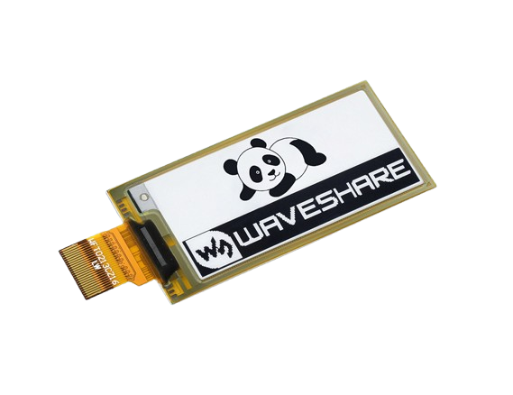
  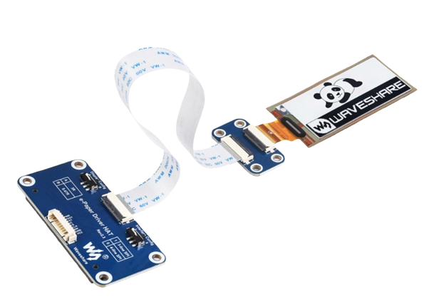  
  [Sizes](datasheets/ePaper-Driver-HAT-size.png) — [Features](datasheets/ePaper-Driver-HAT-features.png) — [SPI Control](datasheets/ePaper-Driver-HAT-SPIcontrol.png) — [Description](datasheets/ePaper-Driver.md)

- [x] Haut parleur - 4Ω - 5 W - Diamètre 7cm

- [x] 1x LED Jaune. _Ref: L0_  
  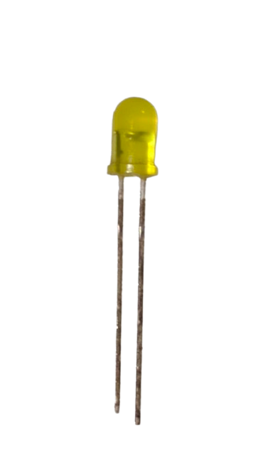
- [x] 1x Résistance 120Ω (sous 3.3v — Vf=2.1v, 10mA). _Ref: R0_

- [x] 3x LEDs oranges (Modes). Prévoir 2 à 3 cd (20 à 30 lumen). _Ref: M1 M2 M3_  
  
- [x] 1x LED verte (BT). _Ref: M4_  
  
- [ ] 4x Résistance 150Ω (sous 3.3v — Vf=2.1v, 8mA/led). _Ref: R21 R22 R23 R24_

- [x] 1x LED bar (7 Leds vertes) Vf=2.2v - 20mA. _Ref: V1 V2 V3 V4 V5 V6 V7_
  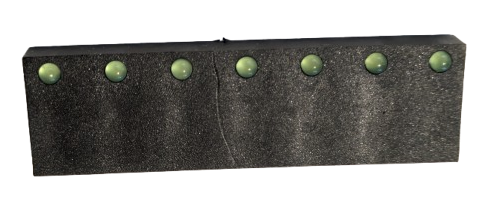
  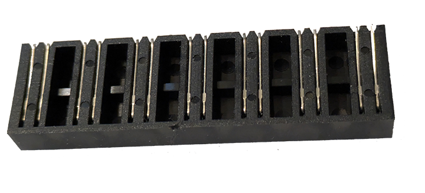

- [x] 7x Résistance 200Ω (sous 3.3v — Vf=2.2v, 5.5mA/led). _Ref: R11 R12 R13 R14 R15 R16 R17_  
  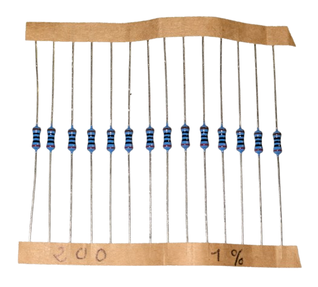

- [x] 2x LEDs E10 (Eclairage tuning). _Ref: L3 L4_   
  Ampoule incandescente 6V/0.25W — sans résistance (filament auto-limitant, ~34mA sous 5v).  
  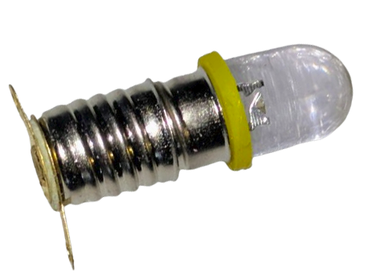

- [x] 2x LEDs blanches (Eclairage ePaper). _Ref: L1 L2_  
  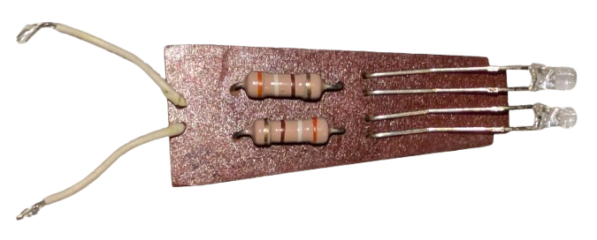
- [x] 2x Résistance 380Ω (sous 5v — Vf=3.2v - 4.7mA/led). _Ref: R1 R2_

### Inputs

- [x] 4x PushButton (Year / Genre / Beat / Bluetooth). _Ref: B1 B2 B3 SW4_  
  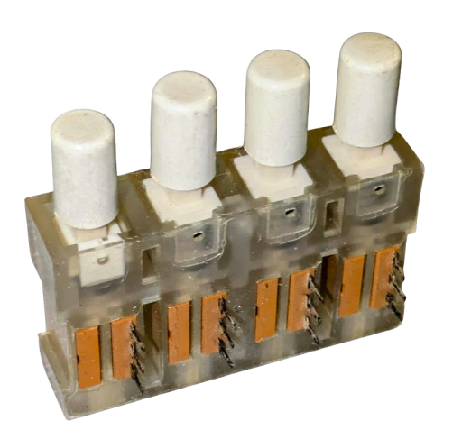
- [x] 3x PushButton (Again / Star me / Next). _Ref: B5 B6 B7_  
  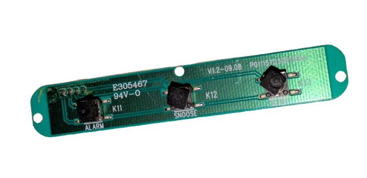
- [x] 8x Résistance pull-up 10kΩ SIL-9 (7 utilisées + 1 spare). _Ref: RS1_  
  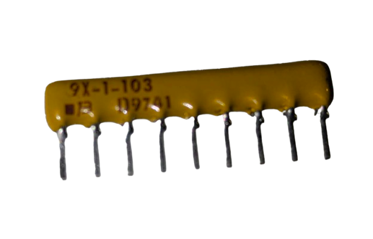

- [x] 1x micro PushButton (Reset database) - En face arrière. _Ref: B8_  
  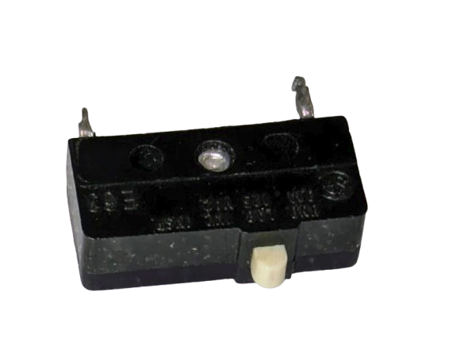
- [x] 1x Résistance 20kΩ pull-up. _Ref: R31_

- [x] 1x Switch Button (Local files/DLNA) - En face arrière. _Ref: SW9_  
  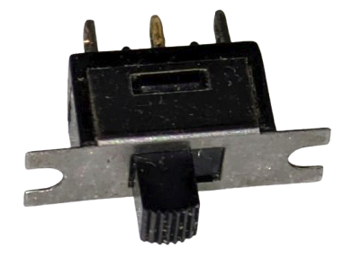
- [x] 1x Résistance 20kΩ pull-up. _Ref: R32_

- [x] 1x Power Button (incl. LED) - En face arrière. Bouton 16mm chrome, anneau LED bleue. _Ref: SW10_  
  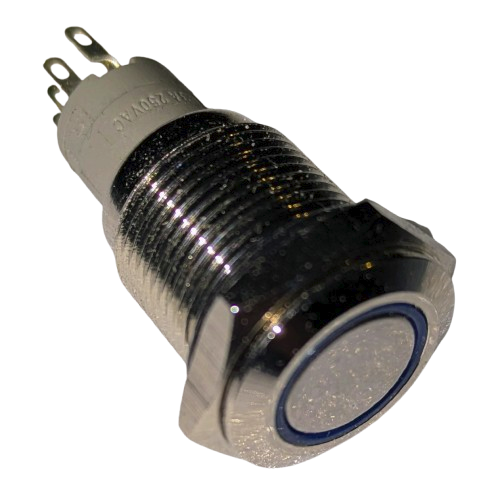
- [x] 1x Résistance 120Ω (LED ring bleue, sous 5v — Vf=3.2v, 15mA). _Ref: RP_

### Composants

- [x] Amplificateur audio (mono)
   InnoMaker RPI HiFi AMP Hat TAS5713 Amplifier Audio Module 25W Class D Power.  
   Sound Card Extension Board for Raspberry Pi 5/4/3/B+/Pi/Zero.  
   Capacitor Nichicon. Connexion SPI. Sortie sur connecteur. Réglage du gain.  
   Power supply = 12/20v.  
   36€ Amazon.  
  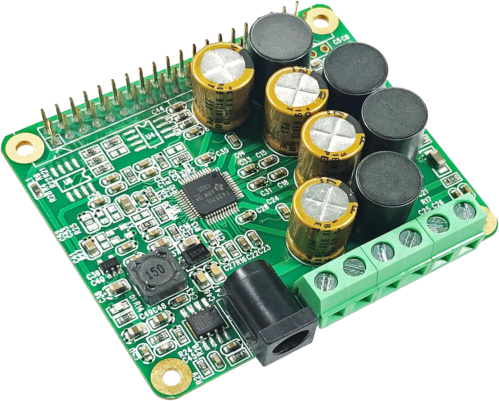
  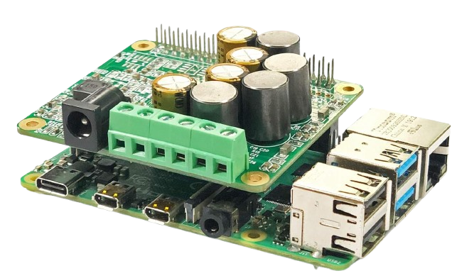  
  [Pinout](datasheets/InnoMaker_TAS5713_pinout.jpg) — [Board map](datasheets/InnoMaker_TAS5713_map.jpg)

- [x] 74HC595 Registres à décalage pour controle des LEDs. Format DIP-16.   
   Amazon 9€ (les 10).  
  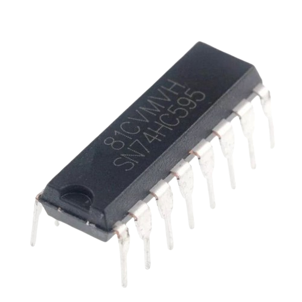  
  [Pinout](datasheets/SN74HCS595_Pinout.png)

- [x] PCF8575 (16-Inputs) I2C Expander pour controle des Pushbutton. Format miniboard.   
   Amazon 7€ (les 2)
  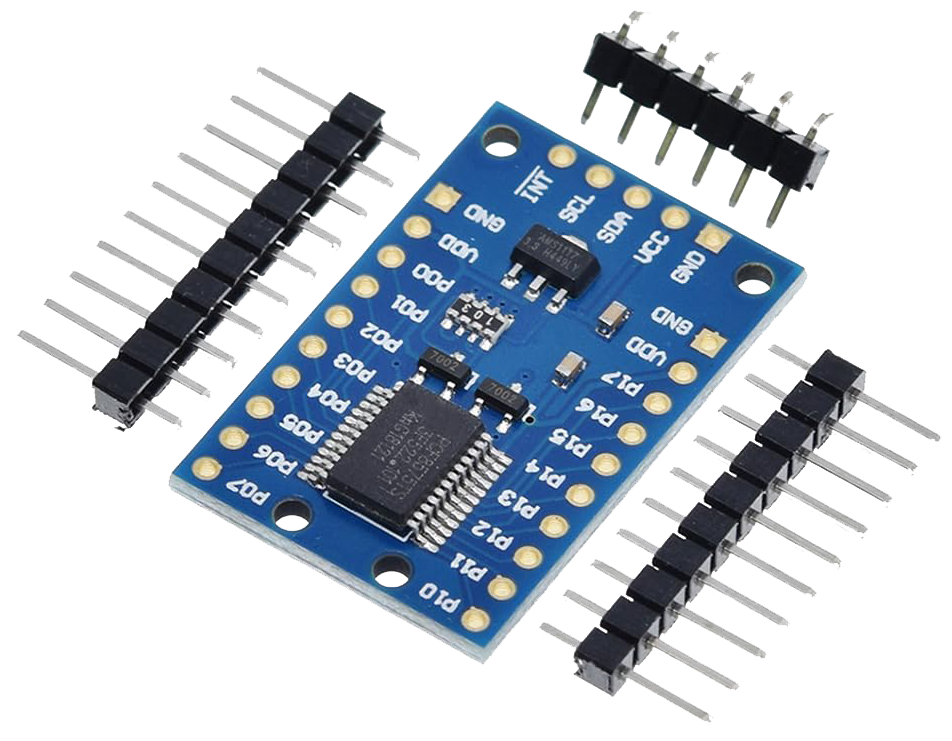 
  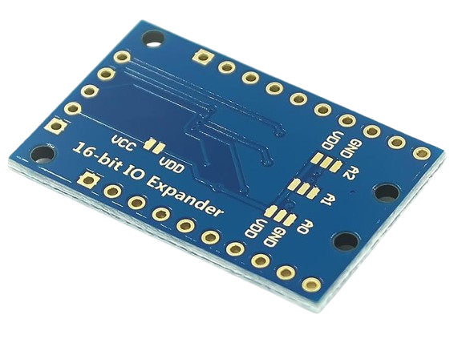  
  [Datasheet](datasheets/PCF8575.md)

- [x] MCP3008 Convertisseur analogique-numerique Adafruit (ADC).  Format DIP-16.  
   8 canaux, 10 bits (1024 valeurs) - Connexion SPI. Lib Python: spidev.    
   Amazon 22€ (les 2).  
  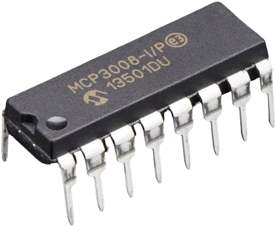  
  [Datasheet](datasheets/MCP3008-Converter.md)
	
- [x] Potentiomètre 10kΩ - linéaire A. _single-turn_.  
	
- [x] Potentiomètre 10kΩ - linéaire A - Avec interrupteur.  

- [ ] Ecran plexi

### Connectique

- [ ] Header 40 double row for Raspberry extension board

### Récapitulatif des résistances

  | Valeur     | Qté       | Refs                        | Usage                       | En stock |
  | ---------- | --------- | --------------------------- | --------------------------- | -------- |
  | 120Ω       | 2         | R0, RP                      | L0 (témoin) + POW (ring)    | oui      |
  | 150Ω       | 4         | R21 R22 R23 R24             | M1–M4 (mode superamber)     |          |
  | 200Ω       | 7         | R11 à R17                   | V1–V7 (LED bar rating)      | oui      |
  | 380Ω       | 2         | R1 R2                       | L1 L2 — backlight ePaper    | oui      |
  | 10kΩ SIL-9 | 1 boîtier | RS1                         | B1–B7 (7 pull-ups, 1 spare) | oui      |
  | 20kΩ       | 2         | R31 R32                     | B8 Reset + SW9 Local/DLNA   | oui      |
