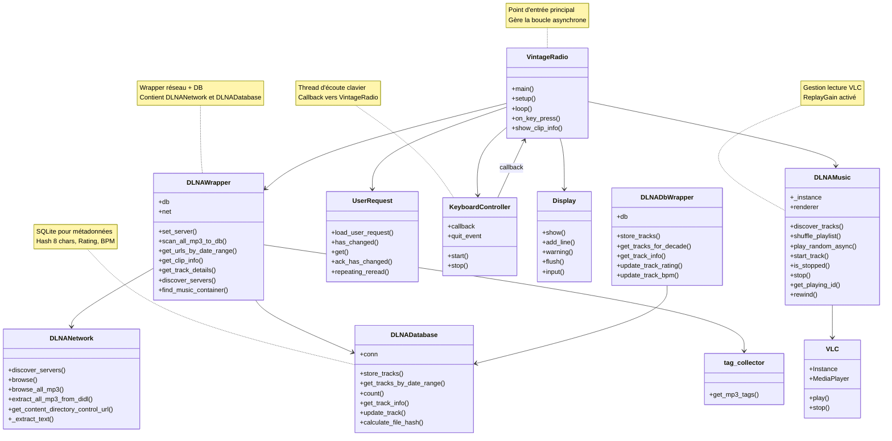

# What each file currently does

| Module	               | Main responsibilities                                                                                                                                                                                                                                                                                                 |
|--------------------------|-----------------------------------------------------------------------------------------------------------------------------------------------------------------------------------------------------------------------------------------------------------------------------------------------------------------------| 
| dlna_preferences.py	   | • Contains the latest DLNA server used, which is supposed to be the preferred server.                                                                                                                                                                                                                                 |
| dlna_user_request.py	   | • Monitor a json file that contains the genre of music that the user wants to ear. This file can change at any moment.                                                                                                                                                                                                |
| dlna_network_wrapper.py  | • Allows the main program to have macro functions to interract with the DLNA server.                                                                                                                                                                                                                                  |
| dlna_network.py	       | • Handles SSDP discovery of DLNA MediaServers.  <br>• Retrieves the device description XML and extracts the ContentDirectory control URL. <br>• Sends SOAP Browse requests and parses the resulting DIDL‑Lite XML. <br>• Provides a helper (extract_mp3_items) that returns a flat list of MP3 URLs from a container. | 
| dlna_music.py            | • Stores the list of MP3 URLs. <br>• Can shuffle the playlist and play a mp3 clip.                                                                                                                                                                                                                                    | 
| dlna_logger.py           | Offre un service de logs, commun à tous les modules.                                                      | 
| keyboard_control.py      | Un listener de clavier (compatible Windows et Raspberry) pour envoyer quelques commandes à l'application. | 


# Problematiques

## pynput requires a graphical display (X server) to capture keyboard input

- On peut remplacer pyinput par termios and tty. OK en mode console, mais ne fonctionne plus sous Windows.
- Il faut implémenter du cross-platform.
   - option 1 : conditionnal imports (Uses only built-in Python modules)
   - option 2 : librairie cross-platfom `readchar`
   Lumo recommande l'option 1 dans notre cas.


## PyCharm ne redirige pas les touches vers l'app

Aller dans le menu `Run -> Edit Configuration -> Modify options` et cocher **Emulate terminal in output console**.


## Raspberry: pas d'echo sur le terminal SSH

Tapez ceci pour rétablir le mode normal sur le terminal bloqué:

```
stty sane
```
##  Schema mermaid


