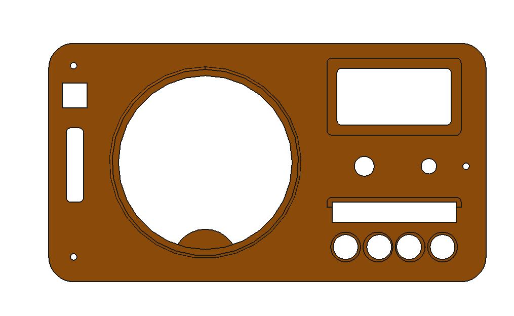
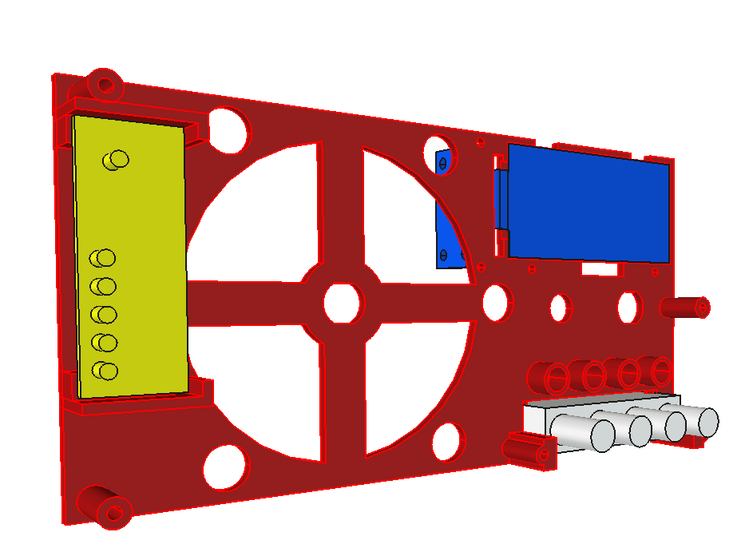
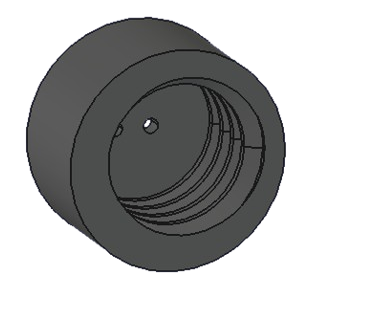
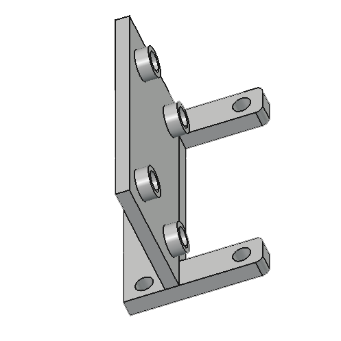

# Vintage Radio — Modèles 3D

Vue d'ensemble du boîtier :

---
## Conseils d'impression

- Activer le body
- Se mettre en vue ortho
- Menu: affichage -> représentation -> (3) filaire
- Menu: fichier -> Imprimer -> Préférences -> Paysage + A4 + Encre noire uniquement.  
On a alors une mise à l'échelle proche de 1:1.
 

## Pièces imprimables

### Face avant

Fichier : [`VintageRadio-Face_Avant.stl`](stl/VintageRadio-Face_Avant.stl)

---

### Support

Fichier : [`VintageRadio-Support.stl`](stl/VintageRadio-Support.stl)

---

### Bouchon LED

Fichier : [`VintageRadio-Bouchon_LED.stl`](stl/VintageRadio-Bouchon_LED.stl)

---

### Rondelle LED

Fichier : [`VintageRadio-Rondelle_LED.stl`](stl/VintageRadio-Rondelle_LED.stl)

---

### Support ePaper (v1)

Fichier : [`VintageRadio-Support_ePaper-1.stl`](stl/VintageRadio-Support_ePaper-1.stl)

---

### Support ePaper (v3)

Fichier : [`VintageRadio-Support_ePaper-3.stl`](stl/VintageRadio-Support_ePaper-3.stl)

---

## Source FreeCAD

Le fichier source est [`VintageRadio.FCStd`](cad/VintageRadio.FCStd).
